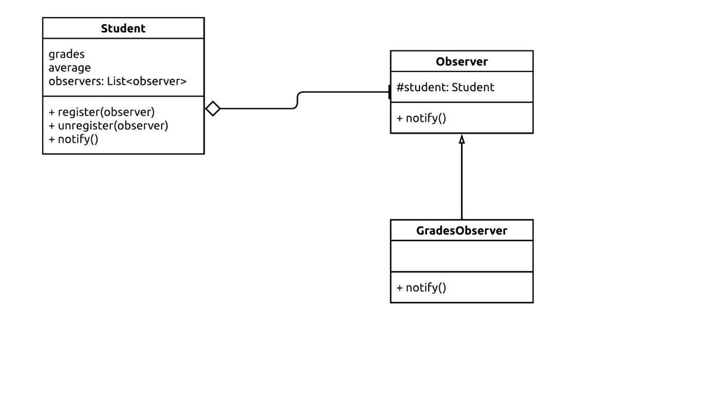

# Design Pattern Observer&nbsp;

This repository is about demonstrating a sample implementation of the Design pattern Observer in Java.

**Read the related article written by "Faouzi EL Mansour" on the blog**: https://numericaideas.com/blog/design-pattern-observer

## Description of the case study

The case study, we will take as an example is a small application that manages notes to illustrate the implementation of the observer pattern in Java. The diagram below presents the architecture of the solution using the design pattern observer.

In this structure, it is possible to classify it into three distinct parts:

1. Subject: Student
2. Observe: Observer
3. ConcreteObserver: GradesObserver.

## Run

It's a normal **Java** project, so you can run it using the run command of an IDE such as: IntelliJ, VS Code etc.
